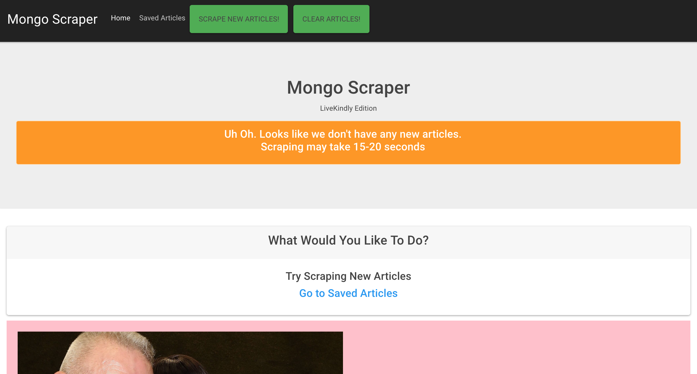
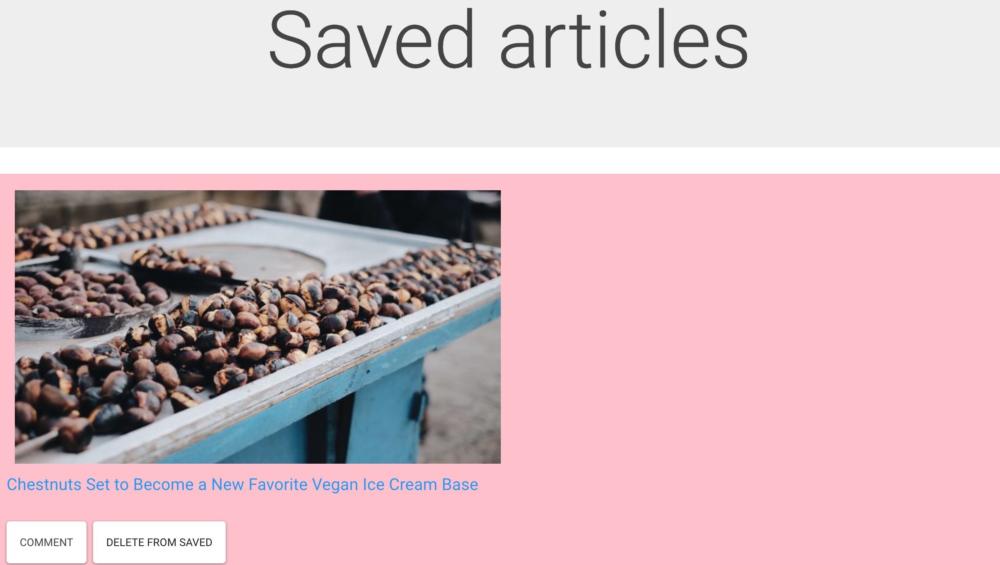

# news-scraper
 a web app that lets users view and leave comments on the latest news

### Overview

Scrape news articles on LiveKindly.co. Save specific articles and leave comments on them.

### In action

Home page:

After scraping:

To search a song: node liri.js spotify-t

To do a preset search read from a txt file: node liri.js do-what-it-says

example:

example:

